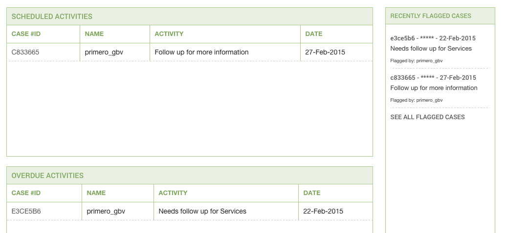
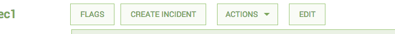

Introduction
============

The GBVIMS Module is a data entry, reporting, and case management tool
to help you collect, store and analyze information on gender based
violence survivors. There is a standard set of forms set forth by the
Steering Committee. that we recommend using, however your Site
Administrator may have to configure these forms specific to your
location and needs. For any questions about the forms and information
you have or need, please reach out to your Site Administrator.

Logging In
----------

Logging into Primero and you’ll see a Username and Password boxes. Click
in the Username box and type in your unique user name provided to you.
Then enter your password in the field below.

Navigating Primero
==================

Header Navigation Bar
-----------------------

The header navigation is the dark bar across the top of the screen in
which you navigate to your home page (or dashboard), Cases, Incidents,
and Reports. It also has a quick search field that can help you find a
specific case quickly. Your current page will be highlighted. See below:

Dashboard or Home page
------------------------

The Dashboard, or Home Page, is where you can find most of the relevant
and significant information around your cases and incidents. It contains
a number of different features including your schedule, recently flagged
cases or incidents, and flags from your manager in the Recently Flagged
Cases.

List View
-----------

When selecting the record type or page you want to visit via the header
navigation, you can see all cases or incidents that belong to you when
you click on CASES or INCIDENTS. Once there, you see a list records,
that you are able to filter and/or sort. See below:

Edit and View a record
--------------------------

When creating a new record, you automatically are brought to the “Edit”
page for that record. You can enter in all the relevant information you
need at this time and save when done.

When selecting an existing record, you are brought to “View” the record.
This means you can view all the data and forms you have permission to,
but cannot edit. You must click the Edit button in the Action Buttons
section of the header to change any information that is currently
represented.

Action Buttons 
-----------------

Our Action Buttons are the buttons just below our Header Navigation,
which allow a user to perform an action on a case or cases. The actions,
depending on your permissions, are:

-   Flag

-   Export

-   Import (List View)

-   Transfer

-   Refer

-   Save (edit view only)

-   Cancel (edit view only)

This bar, along with the Header Navigation bar, are part of what is
called the **Anchored Header**. Meaning, they never leave the screen
when scrolling. This allows a user to easily navigate or act on a case
of number of cases at any time.

My Account and Contact & Help links
-----------------------------------

Above the Header Navigation bar, there are small links that bring you to
pages that help you manage your account and contact information, as well
as find out who is your site administrator.

Creating a New Case 
====================

When creating a new case, use the Actions Buttons area of the header
there is a “Create” button that will open up the forms to enter
information. See the Create button below:

Once in the forms, you can navigate to different forms as we describe in
the Navigating section.

Creating an Incident from a New Case
====================================

Once a case is created, you can then create an incident that is linked
to that case. In the Action Header Bar, there is a button named CREATE
INCIDENT once you have saved the case.

Click on this button, and you will be redirected to the Incident forms
to create a linked incident.

Once in the incident, you can navigate to the proper forms to enter
information about the incident, perpetrator, etc., using the Form
Navigation panel.

Creating a New Incident
=======================

When creating a new incident without a case, use the Actions Buttons area of the header there is a “Create” button that will open up the forms to enter information. See the Create button below:
=================================================================================================================================================================================================

Once in the forms, you can navigate to different forms as we describe in the Navigating section.
================================================================================================

Navigating Primero Forms
========================

Once you are creating or editing a form, you will see a left panel
navigation list. This list is an organized way to navigate through your
forms. The initial titles you see are called **Form Groups** and set up
by your site administrator. The current form you are on will be
highlighted - see below:

If a Form Group has only one form, you can simple click on it and it
will display the form. If it has more than one, you can click on the
Form Group name or the expand icon to the right of the name to expand it
and see all the forms in the group. Once expanded you can then click on
any of the form names to enter into the chosen form.

### Navigating Sub-Forms

In certain data sets and forms, we find that information pertaining to
an event or survivor is nearly identical. For example, information on
specific follow ups can be the same form, just labeled per follow up
type and date. So in cases like this, we’ve designed these forms as
“sub-forms” and you manually add additional individual forms to add
informaton on family members, individual follow ups, etc. To navigate
those, there is an expand/collapse function, and an add and remove
function.

Updating or Editing a Case
==========================

Once you’ve entered into the case you would like to update, you must
click the **EDIT** button in the actions header. The page will then
refresh and allow you edit individual form fields.

There are a number of different field types in which you can edit
differently.

-   **Text** - Type normally using your keypad or keyboard.

-   **Text Area** - Similar to the Text field but can contain
    > more information. Type normally, the field expands for more
    > information as you continue to enter information.

-   **Date** - Multiple ways to edit

    -   You can type in a numerical date in the format of dd-mm-yyyy

    -   You can type in the first three letters of the month in the
        > format of 01-Jan-2014

    -   You can use the calendar widget to navigate to the correct day
        > and select it directly

-   **Check Boxes** - You may click (select) one or many of the options

-   **Tick Box** - You may click on the box - used for yes/no only
    > questions

-   **Select Drop Down** - Multiple ways to edit

    -   You may click in the field and scroll to your answer. Then click
        > to select it.

    -   You may begin typing your answer to show in the
        > selection dropdown. Example: for locations, there are hundreds
        > to scroll through, but if you know your location, you can
        > begin to type it and the values will change with your input.

-   **Radio Button** - Similar to Tick Box, click on the correct
    > answer - used for yes/no/unkown or other similar selections

-   **Numeric Field** - Key the number into the field.

Transfers and Referrals
=======================

Transfers
---------

Transferring is handing over complete care for the survivor to another
service provider with the survivor's informed consent. This signals that
the case will no longer be handled by the organization that is the
source of the transfer. There are some processes surrounding this for a
transfer to a non-primero or outside your instance user. But those will
be determined by your organization and the Standard Operating Procedures
(SOP) of the organization of the person you are transferring to.

To Transfer a record from either the individual record page or the list
view, click on the ACTIONS button in the Action Header. Then, click on
the options for 'Transfer'.

The following modal form will appear and allow you to select options for
your transfer. This form will allow you to select the “Existing User”,
which is a user within your instance of Primero. If the desired user to
transfer to is not in the drop down, it means this user does not have
privileges to be transferred to.

To transfer to a user outside of your primero instance, you select the
checkbox at the bottom of the form, to create a transfer export file
(.JSON or “Primero” format) that is password protected to be shared
outside the system.

Referrals
---------

Referring is contacting another service provider to help meet the
survivors needs with the informed consent of the survivor. When
caseworkers share information with other service providers who can help
the survivor meet their specific needs. For referrals outside of Primero
or to non-Primero users, you will need to determine the appropriate
steps. But those will be determined by your organization and the
Standard Operating Procedure (SOP) of the organization of the person you
are referring to.

To Refer a record from either the individual record page or the list
view, use the ACTIONS button in the Action Header to initiate the drop
down of options. Within the options, select Refer.

The following modal form will appear and allow you to select options for
your refer. This form will allow you to select the “Existing User”,
which is a user within your deployment of Primero. If the desired user
to transfer to is not in the drop down, it means this user does not have
privileges to be referred to.

To refer to a user outside of your primero instance, you select the
checkbox at the bottom of the form, to create a refer export that is
password protected to be shared outside the system.

Filtering
=========

Filtering your Case List or search results is an efficient way to narrow
down to the case or cases that need your immediate attention. You can
filter the list to show not only if a case has other characteristics but
contains specific information within those characteristics as well. For
example, you can filter by males only, but you can also filter by
specific type of violence, and the registration or incident date range.

The Filter panel is on visible on search results page or when you click
**CASES** tab in the header. See below:

In the image, there is the normal checkbox filter selection, in which
you click, but also date range and drop down fields. For Date Ranges,
you can enter these using any of the Date field type actions. You can
set the range for one day as well. For the Drop Down field, this is
clickable and you can only select one value.

Quick Search
============

Quick Search refers to the search field in the header navigation bar.
From here you can type in your search and return a list of possible
matches. This is useful when searching for a specific name or case ID.
After searching, you can filter results further. Currently, this returns
exact matches only.

Exporting Information
=====================

Exporting individual cases/incidents or a list of cases/incidents can be
useful in a number of ways. This action can be found in the **ACTIONS**
header button which will display a drop down to select what format you
want to export - PDF, XLS, CSV, etc.

Once you’ve selected your format, the export modal window will appear,
allowing you to set your own password for the file, and name the file
accordingly. When exporting, you export ALL information available in the
record, including blank fields.

###  {#section-2}

To Export a list of cases, while in the case list view, you can select
as many as you’d like to export via the check boxes:

To Export all cases, you can leave all unchecked and it will export all
cases you have access to.

To Export a single case, you can either check only that case in the case
list, or enter into the case to view it, then use the ACTIONS button to
export.

### Custom Export

This feature will most likely not be available to the average user. If
you find yourself in need of this, and do not have access, please
contact your site administrator.

If you use the custom export, you can select individual forms and even
fields to be exported and their format.

The process begins with Select Format. This organizes the information
you’ve selected into tabs per “Form” when selected, or one tab with a
long row of “Fields” when selected. You then select the Module from the
drop down that will populate the appropriate forms and field available
using the **Select Drop Down** functionality described earlier in the
**Field Types** section.
